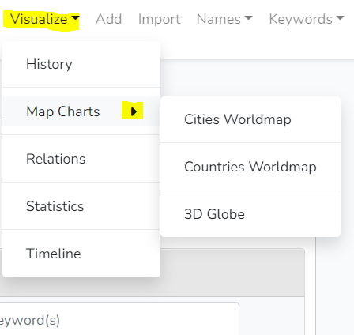

# YARM_Visualizations
# Version Gitlab!

## Usage (follow/run the following commands in your terminal)

to install package

> composer require yarm/visualizations

publish routes, config, views, en JS
> php artisan vendor:publish --provider="Yarm\Visualizations\VisualizationsServiceProvider" --force

 
# Note
* Don't forget to restart npm after installation

# Image (button appears in menu)

